Understanding Uncertainty in Ecological Forecasts
================
Mary Lofton, Tadhg Moore, R.Quinn Thomas, Cayelan Carey
2023-04-05

## Purpose of this R Markdown

This R Markdown contains code to reproduce the basic functionality of
“Macrosystems EDDIE Module 6: Understanding Uncertainty in Ecological
Forecasts” outside of R Shiny. The code can be used by students to
better understand what is happening “under the hood” of the Shiny app,
which can be found at the following link:  
<https://macrosystemseddie.shinyapps.io/module6/>.

Alternatively, students can complete this version of the module instead
of the Shiny app version.

## Summary

**Ecological forecasting** is a tool that can be used for understanding
and predicting changes in populations, communities, and ecosystems.
Ecological forecasting is an emerging approach which provides an
estimate of the future state of an ecological system with uncertainty,
allowing society to prepare for changes in important ecosystem services.

Forecast **uncertainty** is derived from multiple sources, including
model parameters and driver data, among others. Knowing the uncertainty
associated with a forecast enables forecast users to evaluate the
forecast and make more informed decisions. Ecological forecasters
develop and update forecasts using the iterative forecasting cycle, in
which they make a hypothesis of how an ecological system works; embed
their hypothesis in a model; and use the model to make a forecast of
future conditions and quantify forecast uncertainty. There are a number
of approaches that forecasters can use to reduce uncertainty, which will
be explored in this module.

This module will guide you through an exploration of the sources of
uncertainty within an ecological forecast, how uncertainty can be
quantified, and steps which can be taken to reduce the uncertainty in a
forecast you develop for a lake ecosystem.

## Learning Outcomes

1.  Define ecological forecast uncertainty.  
2.  Explore the contributions of different sources of uncertainty (e.g.,
    model parameters, model driver data) to total forecast uncertainty.
3.  Understand how multiple sources of uncertainty are quantified.
4.  Identify ways in which uncertainty can be reduced within an
    ecological forecast.
5.  Describe how forecast horizon affects forecast uncertainty.
6.  Explain the importance of specifying uncertainty in ecological
    forecasts for forecast users and decision support.

## Key Concepts

### What is ecological forecast uncertainty?

Uncertainty emerges from some kind of error or imperfection in our
knowledge and understanding of the ecological system being investigated.

### Where does ecological forecast uncertainty come from?

Uncertainty comes from natural variability in the environment and
imperfect knowledge of an ecological system. When generating a forecast,
uncertainty can come from the structure of the model used, the
conditions the model is initialized with, and the data used to drive the
model, among other sources.

### Why is uncertainty important to quantify for an ecological forecast?

Knowing the uncertainty in a forecast allows forecast users to make
informed decisions based on the range of forecasted outcomes and prepare
accordingly.

## Overview

In this module, we will generate forecasts of lake water temperature for
1-7 days into the future. First, we will generate a **deterministic**
forecast (with no uncertainty). This will involve the following steps:

1.  Read in and visualize data from Lake Barco, FL, USA.
2.  Read in and visualize an air temperature forecast for Lake Barco.
3.  Build a multiple linear regression forecast model.
4.  Generate a deterministic forecast (without uncertainty).

Next, we will explore how to incorporate four different kinds of
uncertainty that are commonly present in **probabilistic** forecasts:
driver data uncertainty, parameter uncertainty, process uncertainty, and
initial conditions uncertainty. We will generate forecasts that
incorporate these sources of uncertainty one at a time to learn how each
form of uncertainty is accounted for. This will involve the following
steps:

5.  Generate a forecast with driver uncertainty.
6.  Generate a forecast with parameter uncertainty.
7.  Generate a forecast with process uncertainty.
8.  Generate a forecast with initial conditions uncertainty.

Finally, we will put it all together to generate a forecast that
incorporates all four sources of uncertainty. We will also explore the
relative contributions of each source of uncertainty to total forecast
uncertainty; this is known as **uncertainty partitioning**. This will
involve the following steps:

9.  Generate a forecast incorporating all sources of uncertainty.
10. Partition uncertainty.

There are a total of 20 questions embedded throughout this module, many
of which parallel (and in some cases are identical to) questions in the
R Shiny app version of the module. Questions which are identical to
those in the Shiny app will be indicated with **(Shiny)**, while
questions unique to this RMarkdown will be indicated with **(Rmd)**.
Note that question numbers will differ between the RMarkdown and the
Shiny app, even if the question text is the same. Please see the module
rubric for possible points per question and confirm with your instructor
whether and how the module will be graded.

## Think About It!

**Q.1 (Shiny)** What is meant by the term ‘uncertainty’ in the context
of ecological forecasting?

**Answer Q.1**

**Q.2 (Shiny)** How do you think knowing the uncertainty in a forecast
helps natural resource managers? For example, if a drinking water
manager received a toxic algal bloom forecast with high vs. low
uncertainty in a bloom prediction, how might that affect their
decision-making?

**Answer Q.2**

## Set-up

We will install and load some packages that are needed to run the module
code. If you do not currently have the packages below downloaded for
RStudio, you will need to install them first using the
`install.packages()` function.

``` r
# install.packages("tidyverse")
# install.packages("lubridate")
# install.packages("RColorBrewer")
# install.packages("ggthemes")
library(tidyverse)
library(lubridate)
library(RColorBrewer)
library(ggthemes)
set.seed(100)

source("./plot_functions.R")
```

## 1. Read in and visualize data from Lake Barco, FL, USA

Lake Barco is one of the lake sites in the U.S. National Ecological
Observatory Network (NEON). Please refer to
<https://www.neonscience.org/field-sites/barc> to learn more about this
site.

**Q.3 (Shiny)** Use the website linked above to fill out information
about Lake Barco:

**Answer Q.3**

Four letter site identifier:  
Latitude:  
Longitude:  
Lake area (km2):  
Elevation (m):

### Water Temperature

Water temperature exerts a major influence on biological activity and
growth, has an effect on water chemistry, can influence water quantity
measurements, and governs the kinds of organisms that live in water
bodies.

Water temperature can have important effects on water quality, as
changes in water temperature can directly or indirectly affect water
quality variables such as dissolved oxygen, nutrient and heavy metal
concentrations, and algae concentrations.

Freshwater ecosystems are currently experiencing a multitude of
stressors such as land use change and climate change, which can affect
water temperature.

Being able to predict how water temperature may change in the short-term
(up to 7-days into the future) can provide natural resource managers
with critical information to take pro-active actions to prevent
degradation of water quality.

**Q.4 (Shiny)** List two potential impacts on lakes and inland water
bodies as a result of increasing water temperature.

**Answer Q.4**

Read in and view lake data.

``` r
lake_df <- read_csv("data/BARC_airt_wtemp_celsius.csv", show_col_types = FALSE)
```

Build a time series plot of air temperature and water temperature. If
you are comparing to the Shiny app, this should match the time series
plot you see in “Activity A, Objective 3: Build a water temperature
model” IF you selected Lake Barco as your site.

``` r
plot_lake_data(lake_df)
```

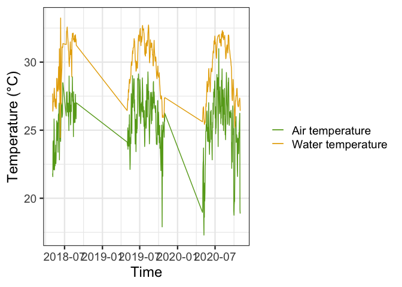<!-- -->

**Q.5 (Shiny)** Do you think there is a linear relationship between air
temperature and water temperature at this lake?

**Answer Q.5**

## 2. Read in and visualize an air temperature forecast for Lake Barco

We expect that future air temperatures will affect future water
temperatures, and so we will use air temperature forecasts to help
create water temperature forecasts.

We have obtained an air temperature forecast for Lake Barco from the
U.S. National Oceanic and Atmospheric Administration Global Ensemble
Forecast System (NOAA GEFS).

NOAA GEFS forecasts are **ensemble forecasts**. Ensemble forecasts are
generated by running a model many times with different conditions. For
example, a weather model used for forecasting might be run many times
using slightly different starting conditions, because it is difficult to
observe the atmosphere perfectly and so we are not exactly sure what the
current conditions are. All the model runs together are referred to as
the **ensemble**. Each individual model run is referred to as an
**ensemble member**. Forecasters typically generate tens to hundreds of
ensemble members to build uncertainty into their forecasts.

Here, we read in NOAA forecast data that has been wrangled into a
suitable format for our exercise: a two-dimensional data frame
containing a 7-day-ahead air temperature forecast with 30 ensemble
members.

Read in and view air temperature forecast. We will be working with a
NOAA forecast generated on 2020-09-25

``` r
weather_forecast <- read_csv("./data/BARC_airt_forecast_NOAA_GEFS.csv", show_col_types = FALSE)
```

Voila! We now have an object called “weather_forecast” which is a
two-dimensional data frame containing a 7-day-ahead NOAA air temperature
forecast. Let’s look at “weather_forecast”.

``` r
head(weather_forecast)
```

    ## # A tibble: 6 × 4
    ##   forecast_date ensemble_member variable        value
    ##   <date>                  <dbl> <chr>           <dbl>
    ## 1 2020-09-25                  1 air_temperature  27.0
    ## 2 2020-09-26                  1 air_temperature  27.6
    ## 3 2020-09-27                  1 air_temperature  28.0
    ## 4 2020-09-28                  1 air_temperature  25.8
    ## 5 2020-09-29                  1 air_temperature  25.3
    ## 6 2020-09-30                  1 air_temperature  21.4

The columns are the following:  
- **forecast_date**: this is the date for which temperature is
forecasted.  
- **forecast_variable**: this is the variable being forecasted.  
- **ensemble_member**: this is an identifier for each member of the
30-member ensemble.  
- **value**: this is the value of the forecasted variable (in our case,
degrees Celsius).

Now we will plot the NOAA forecast.

Data wrangling of observed air temperature data at Lake Barco so we can
plot observed and forecasted air temperature on one time series plot

``` r
forecast_start_date <- "2020-09-25"

lake_obs <- lake_df %>%
  filter(date >= "2020-09-22" & date <= "2020-10-02") %>%
  mutate(wtemp = ifelse(date > forecast_start_date, NA, wtemp),
         airt = ifelse(date > forecast_start_date, NA, airt))
```

Build plot. This should match the time series plot in Activity B,
Objective 9 - Driver Uncertainty IF you selected Lake Barco as your site

``` r
plot_airtemp_forecast(lake_obs, weather_forecast, forecast_start_date)
```

    ## Warning: Removed 7 rows containing missing values (`geom_point()`).

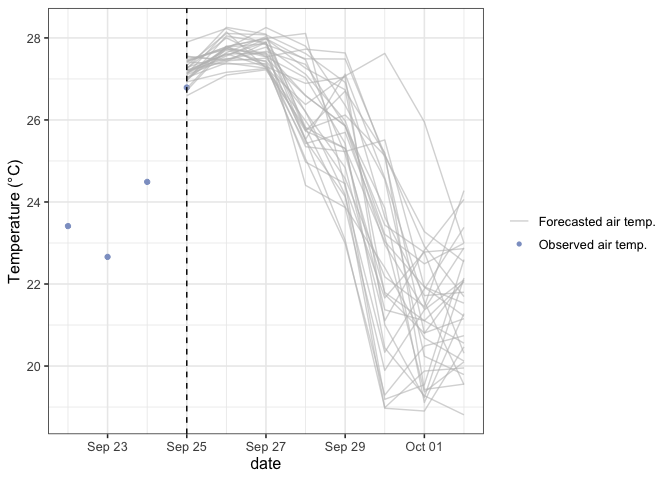<!-- -->

**Q.6 (Rmd)** Why are there multiple gray lines on the plot above? What
do they represent? Be as specific as you can.

**Answer Q.6**

## 3. Build a linear regression forecast model

We will use observed water temperature and air temperature data to build
a linear regression model to predict water temperature.

### Key Terms for Ecological Modeling and Forecasting

#### What is an ecological model?

A model is a representation (physical, conceptual or mathematical) of a
real ecological phenomenon that is difficult to observe directly (e.g.,
the abundance of foxes in a forest).

#### What is a linear relationship?

A linear relationship is a statistical term used to describe a
straight-line relationship between two variables. Linear relationships
can be expressed either in a graphical format where the variable and the
constant are connected via a straight line or in a mathematical format
where the independent variable is multiplied by the slope coefficient,
added by a constant, which determines the dependent variable. A
*multiple linear regression* includes more than one independent
variable, each multipled by its own coefficient.

In our example, water temperature is the dependent variable and lagged
water temperature and air temperature are the independent variables.

#### What is model error?

Model error is the difference between an observation and the estimated
value from the model. In this module, we assess the fit of our model by
calculating three metrics:

1.  Coefficient of determination ($R^2$)
2.  Mean bias
3.  Root mean square error (RMSE)

See the code below to understand how these metrics are calculated. A
lower RMSE and mean bias indicate better model performance, while a
higher $R^2$ indicates better model performance.

#### What is a parameter?

A parameter is a value in a model that describes the rate of change in
those states.

#### What is a parameter distribution?

A parameter distribution shows the possible values for a parameter value
and how often they occur. For example, a normal distribution of a
parameter has a bell-shaped curve, and the mean is the most likely value
of that parameter.

### Fitting model

First, build a data frame to fit the model. We will create a column
`wtemp_yday` which is a column of 1-day lags of water temperature.

``` r
model_data <- lake_df %>%
  mutate(wtemp_yday = lag(wtemp))
head(model_data)
```

    ## # A tibble: 6 × 4
    ##   date        airt wtemp wtemp_yday
    ##   <date>     <dbl> <dbl>      <dbl>
    ## 1 2018-05-04  21.8  27.7       NA  
    ## 2 2018-05-05  21.6  26.4       27.7
    ## 3 2018-05-06  24.1  26.6       26.4
    ## 4 2018-05-07  24.2  27.1       26.6
    ## 5 2018-05-08  22.1  27.1       27.1
    ## 6 2018-05-09  22.1  27.1       27.1

Fit a multiple linear regression model using yesterday’s water
temperature and today’s air temperature to predict today’s water
temperature.

``` r
linear_fit <- lm(model_data$wtemp ~ model_data$airt + model_data$wtemp_yday)
fit_summary <- summary(linear_fit)
```

View model coefficients and save them for our forecasts later.

``` r
coeffs <- round(linear_fit$coefficients, 2)
coeffs
```

    ##           (Intercept)       model_data$airt model_data$wtemp_yday 
    ##                  0.95                  0.18                  0.81

View standard errors of estimated model coefficients and save them for
our forecasts later.

``` r
params_se <- fit_summary$coefficients[,2]
params_se
```

    ##           (Intercept)       model_data$airt model_data$wtemp_yday 
    ##            0.44627386            0.01852255            0.01976459

Calculate model predictions.

``` r
mod <- predict(linear_fit, data = model_data)
mod <- c(NA, mod)
```

Assess model fit by calculating $R^2$ (`r2`), mean bias (`err`), and
RMSE (`RMSE`).

``` r
r2 <- round(fit_summary$r.squared, 2) 
err <- mean(mod - lake_df$wtemp, na.rm = TRUE) 
rmse <- round(sqrt(mean((mod - lake_df$wtemp)^2, na.rm = TRUE)), 2) 
```

Prepare data frames for plotting.

``` r
lake_df2 <- lake_df %>%
  filter(date > "2020-01-01")
  
pred <- tibble(date = model_data$date,
               model = mod) %>%
  filter(date > "2020-01-01")
```

Build plot of modeled and observed water temperature. This should match
the plot you see in the Shiny app Activity A, Objective 3 - Build a
water temperature model IF you selected Lake Barco as your site.

``` r
mod_predictions_watertemp(lake_df2, pred)
```

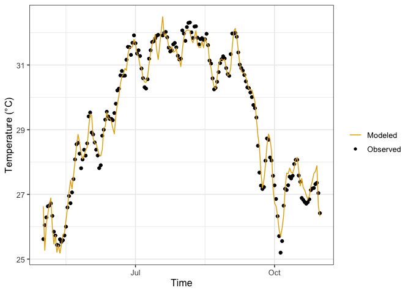<!-- -->

**Q.7 (Rmd)** Describe the structure of the multiple linear regression
model in your own words. How is water temperature being predicted?

**Answer Q.7**

**Q.8 (Rmd)** Examine the values of the fitted model parameters
(`coeffs`). What does this tell you about the relative importance of
past water temperature and current air temperature in driving current
water temperature? Examine the standard errors of the parameters
(`params_se`). What do the standard errors tell you about how confident
we are in the fitted model parameter values?

**Answer Q.8**

**Q.9 (Rmd)** Assess the model fit. Examine the values of `r2`, `err`,
and `rmse`, as well as the plot showing the model fit and observations.
What does this tell you about model performance?

**Answer Q.9**

## 4. Generate a deterministic forecast (without uncertainty)

Now we will generate a deterministic forecast with our model. We will
use **one** ensemble member from the NOAA GEFS air temperature forecast
ensemble as input to our multiple linear regression model, thus
producing a water temperature prediction for 1 to 7 days into the future
with no uncertainty.

Set number of ensemble members; this is set to 1 because we are making a
deterministic forecast.

``` r
n_members <- 1
```

Set up a date vector of dates we want to forecast. Our maximum forecast
horizon (the farthest into the future we want to forecast) is 7 days.

``` r
forecast_horizon <- 7
forecasted_dates <- seq(from = ymd(forecast_start_date), to = ymd(forecast_start_date)+7, by = "day")
```

Pull the current observed water temperature to be our initial, or
starting, condition.

``` r
curr_wt <- lake_df %>% 
  filter(date == forecast_start_date) %>%
  pull(wtemp)
```

Setting up an empty dataframe that we will fill with our water
temperature predictions. Here, the `mutate()` function is used to insert
the current observed water temperature as the initial condition and set
all future values of water temperature to NA, which will subsequently be
replaced with forecasted values by our model.

``` r
forecast_deterministic <- tibble(forecast_date = rep(forecasted_dates, times = n_members),
                            ensemble_member = rep(1:n_members, each = length(forecasted_dates)),
                            forecast_variable = "water_temperature",
                            value = as.double(NA),
                            uc_type = "deterministic") %>%
  mutate(value = ifelse(forecast_date == forecast_start_date, curr_wt, NA))
```

Run forecast. Here, we loop through days into the future and generate
predictions with our multiple regression model using yesterday’s water
temperature and today’s air temperature. Note the use of the
`rows_update()` function to replace NAs with forecasted water
temperature values each day.

``` r
for(i in 2:length(forecasted_dates)) {
  
  #pull prediction dataframe for relevant date
    temp_pred <- forecast_deterministic %>%
      filter(forecast_date == forecasted_dates[i])
    
  #pull driver data for relevant date; here we select only 1 ensemble member from the NOAA air temperature forecast
    temp_driv <- weather_forecast %>%
      filter(forecast_date == forecasted_dates[i] & ensemble_member == 1)
    
   #pull lagged water temp values
    temp_lag <- forecast_deterministic %>%
      filter(forecast_date == forecasted_dates[i-1])
    
  #run model
    temp_pred$value <- coeffs[1] + temp_driv$value * coeffs[2] + temp_lag$value * coeffs[3] 
    
  #insert values back into forecast dataframe
    forecast_deterministic <- forecast_deterministic %>%
      rows_update(temp_pred, by = c("forecast_date","ensemble_member","forecast_variable", "uc_type"))
}
```

Build plot. This should resemble the plot in the R Shiny app Activity B
Overview, labeled “Water Temperature Forecast”; here, we are plotting
the “Both” model, which uses both yesterday’s water temperature and
today’s forecasted air temperature to forecast water temperature

``` r
plot_forecast(lake_obs, 
              forecast = forecast_deterministic, 
              forecast_start_date,
              title = "Deterministic forecast")
```

    ## Warning: Removed 7 rows containing missing values (`geom_point()`).

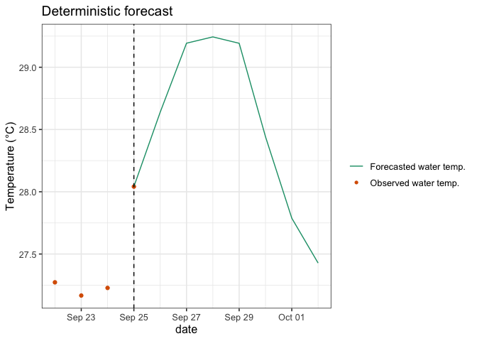<!-- -->

**Q.10 (Rmd)** Compare the water temperature forecast plot above to the
plot of the NOAA GEFS air temperature forecast. Does the forecasted
water temperature track the forecasted air temperature, and why might
this be?

**Answer Q.10**

### What is wrong with deterministic forecasts?

Using a **deterministic** forecast (e.g. a forecast which is one single
line, with no uncertainty) is guaranteed to be wrong, because it ignores
the uncertainty that is inherently associated with the future.

There are many things which contribute to uncertainty when generating a
forecast, and a forecast should represent the range of potential
outcomes and the **likelihood** of such outcomes occurring.

Therefore, we need to generate a **probabilistic** forecast which
represents both the range of outcomes and also the likelihood of each.

## 5. Generate a forecast with driver uncertainty

As a first step towards developing a probabilistic forecast, we will
generate a forecast that incorporates **driver uncertainty**. Driver
uncertainty comes from inaccuracies in the forecasted variables used as
inputs to the forecast model. The driver variable for our model is air
temperature. To generate a forecast of future water temperature that
incorporates driver uncertainty, we need to use all 30 members of the
NOAA GEFS air temperature forecast ensemble and generate a water
temperature forecast with each one. Together, these 30 water temperature
forecasts, each generated using a different NOAA GEFS ensemble member,
will comprise an ensemble forecast of water temperature that accounts
for driver uncertainty.

Set number of ensemble members; notice we now use the entire NOAA
forecast ensemble with 30 members.

``` r
n_members <- 30 
```

Setting up an empty dataframe that we will fill with our water
temperature predictions. Notice that this dataframe is much longer than
the `forecast_deterministic` dataframe because we are now forecasting
with 30 ensemble members.

``` r
forecast_driver_unc <- tibble(forecast_date = rep(forecasted_dates, times = n_members),
                            ensemble_member = rep(1:n_members, each = length(forecasted_dates)),
                            forecast_variable = "water_temperature",
                            value = as.double(NA),
                            uc_type = "driver") %>%
  mutate(value = ifelse(forecast_date == forecast_start_date, curr_wt, NA)) 
```

Run forecast. Notice that we now pull the entire driver ensemble of the
NOAA forecast for each day instead of just ensemble member 1.

``` r
for(i in 2:length(forecasted_dates)) {
  
  #pull prediction dataframe for relevant date
    temp_pred <- forecast_driver_unc %>%
      filter(forecast_date == forecasted_dates[i])
    
  #pull driver ensemble for relevant date; here we are using all 30 NOAA ensemble members
    temp_driv <- weather_forecast %>%
      filter(forecast_date == forecasted_dates[i])
    
   #pull lagged water temp values
    temp_lag <- forecast_driver_unc %>%
      filter(forecast_date == forecasted_dates[i-1])
    
  #run model
    temp_pred$value <- coeffs[1] + temp_driv$value * coeffs[2] + temp_lag$value * coeffs[3] 
    
  #insert values back into forecast dataframe
    forecast_driver_unc <- forecast_driver_unc %>%
      rows_update(temp_pred, by = c("forecast_date","ensemble_member","forecast_variable","uc_type"))
}
```

Build plot - this should resemble the water temperature forecast plot in
the R Shiny app, Activity B Objective 9 (“Both” model)

``` r
plot_forecast(lake_obs, 
              forecast = forecast_driver_unc, 
              forecast_start_date,
              title = "Forecast with Driver Uncertainty")
```

    ## Warning: Removed 7 rows containing missing values (`geom_point()`).

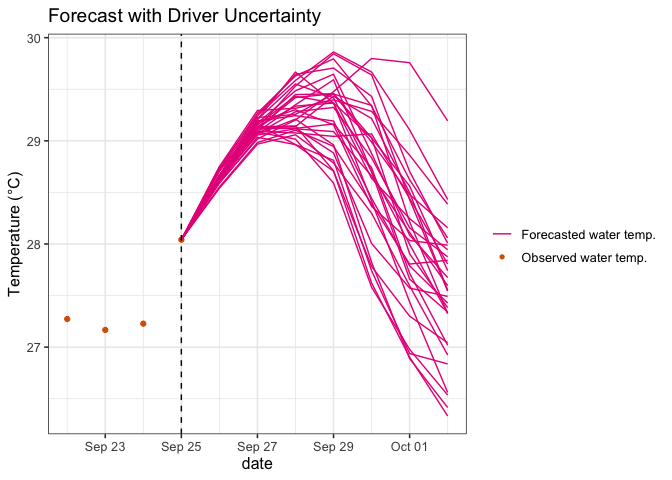<!-- -->

**Q.11 (Shiny)** How does forecast uncertainty change further into the
future?

**Answer Q.11**

**Q.12 (Rmd)** Compare the plot above of the probabilistic forecast with
driver uncertainty to the plot of the deterministic forecast. How do the
differences in these two forecasts affect your understanding of what
water temperatures are likely to be during the week of the forecast?

**Answer Q.12**

**Q.13 (Shiny)** Can you think of a way to reduce driver uncertainty in
your forecast of water temperature?

**Answer Q.13**

## 6. Generate a forecast with parameter uncertainty

**Parameter uncertainty** refers to the uncertainty in the model
parameter values, which can be due to uncertainties in the data or the
calibration process used.

With traditional modelling efforts, people general find one set of the
‘best fit’ parameters and use them to predict with their model.

This method does not account for the uncertainty around the estimation
of these parameters.

There is often the possibility that different parameter sets can yield
similar metrics of model performance, e.g., similar R-squared values.

Using parameter distributions allows for a better representation of the
potential predicted outcomes, leading to better quantification of the
uncertainty.

Here, you will use the standard errors of the parameters we estimated to
generate distributions around each model parameter. You will then use
these parameter distributions to incorporate parameter uncertainty into
your water temperature forecasts.

Our model has three parameters: $\beta_1$, the intercept of the linear
regression, $\beta_2$, the coefficient on tomorrow’s air temperature,
and $\beta_3$, the coefficient on today’s water temperature.

$$WaterTemp_{t+1} = \beta_1 + \beta_2*AirTemp_{t+1} + \beta_3*WaterTemp_t$$
When we fit our model, we obtained an estimate of the error around the
mean of each of these parameters, which is stored in the `params_se`
object. So instead of thinking of parameters as fixed values, we can
think of them as distributions (here, a normal distribution) with some
mean $(\mu)$ and variance (here represented by standard deviation, or
$\sigma$):

$$\beta_1 \sim {\mathrm Norm}(\mu, \sigma)$$

Now, we will generate parameter distributions based on parameter
estimates for the linear regression model.

**HINT** Examine the `coeffs` and `params_se` objects we created when we
fit the multiple regression model above. Think about what information
they contain and how you might use that information to generate a
**parameter distribution**.

``` r
coeffs
```

    ##           (Intercept)       model_data$airt model_data$wtemp_yday 
    ##                  0.95                  0.18                  0.81

``` r
params_se
```

    ##           (Intercept)       model_data$airt model_data$wtemp_yday 
    ##            0.44627386            0.01852255            0.01976459

**HINT** Look at the help documentation for the `rnorm()` function,
which can be used to generate draws from a normal distribution with a
specified mean and standard deviation. Note that **standard error** is
defined as the standard deviation on the mean.

``` r
?rnorm
```

Create an example distribution.

``` r
example_distribution <- tibble(draws = rnorm(n = 1000, mean = 0, sd = 1))
```

Plot the example distribution. Here we are using base plot, not ggplot,
to keep the code to a single line.

``` r
hist(example_distribution$draws)
```

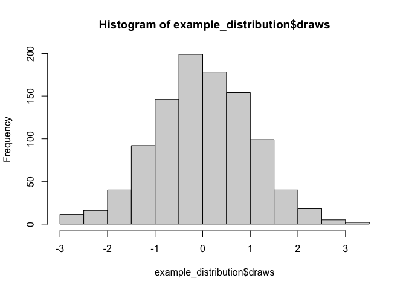<!-- -->

Use the `rnorm()` function and the information in the `coeffs` and
`params_se` objects to generate parameter distributions for each of the
parameters in the multiple regression model.

``` r
param_df <- data.frame(beta1 = rnorm(30, coeffs[1], params_se[1]),
                 beta2 = rnorm(30, coeffs[2], params_se[2]),
                 beta3 = rnorm(30, coeffs[3], params_se[3]))
```

Plot each of the parameter distributions you have created.

``` r
plot_param_dist(param_df)
```

    ## Using  as id variables

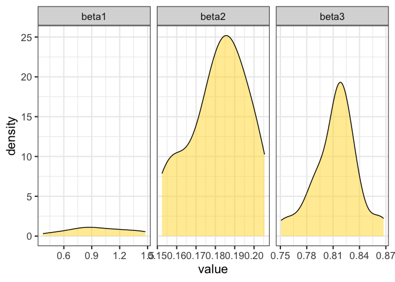<!-- -->

Now, we will adjust the forecasting for-loop to incorporate parameter
uncertainty into your forecasts.

**NOTE** Similar to how we used each of the 30 NOAA GEFS ensemble
members to generate 30 slightly different forecasts that made up an
ensemble with driver uncertainty, we will need to use slightly different
parameter values to generate multiple forecasts that together, make up
an ensemble incorporating parameter uncertainty. So here, each of our
water temperature forecast ensemble members will use the **same** NOAA
forecast but will have **different** parameter values drawn from our
parameter distributions. This allows us to quantify how much uncertainty
is coming from our model parameters while holding all other sources of
uncertainty constant.

Setting up an empty dataframe that we will fill with our water
temperature predictions.

``` r
forecast_parameter_unc <- tibble(forecast_date = rep(forecasted_dates, times = n_members),
                            ensemble_member = rep(1:n_members, each = length(forecasted_dates)),
                            forecast_variable = "water_temperature",
                            value = as.double(NA),
                            uc_type = "parameter") %>%
  mutate(value = ifelse(forecast_date == forecast_start_date, curr_wt, NA)) 
```

Run forecast.

**Notice** that we only pull a single member of the NOAA air temperature
forecast so that we can focus on the contribution of parameter
uncertainty alone to our forecast.

**Notice** that parameter values are now pulled from our `param_df`
distributions instead of the `coeffs` object, so our parameter values
are now uncertain rather than fixed.

``` r
for(i in 2:length(forecasted_dates)) {
  
  #pull prediction dataframe for relevant date
    temp_pred <- forecast_parameter_unc %>%
      filter(forecast_date == forecasted_dates[i])
    
  #pull driver data for relevant date; here we select only 1 ensemble member from the NOAA air temperature forecast
    temp_driv <- weather_forecast %>%
      filter(forecast_date == forecasted_dates[i] & ensemble_member == 1)
    
  #pull lagged water temp values
    temp_lag <- forecast_parameter_unc %>%
      filter(forecast_date == forecasted_dates[i-1])
    
  #run model using parameter distributions instead of fixed values
    temp_pred$value <- param_df$beta1 + temp_driv$value * param_df$beta2 + temp_lag$value * param_df$beta3
    
  #insert values back into forecast dataframe
    forecast_parameter_unc <- forecast_parameter_unc %>%
      rows_update(temp_pred, by = c("forecast_date","ensemble_member","forecast_variable","uc_type"))
}
```

Build plot - this should resemble the water temperature forecast plot in
the R Shiny app, Activity B Objective 7 (“Both” model)

``` r
plot_forecast(lake_obs, 
              forecast = forecast_parameter_unc, 
              forecast_start_date,
              title = "Forecast with Parameter Uncertainty")
```

    ## Warning: Removed 7 rows containing missing values (`geom_point()`).

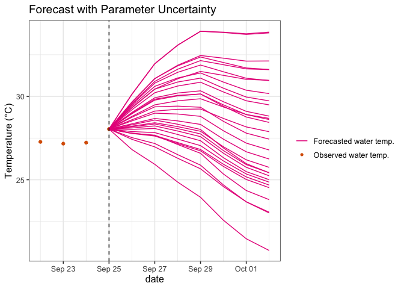<!-- -->

**Q.14 (Shiny)** Can you think of potential ways to reduce parameter
uncertainty?

**Answer Q.14**

## 7. Generate a forecast with process uncertainty

**Process uncertainty** is uncertainty caused by our inability to model
all processes as observed in the real world.

Our “simple” water temperature model uses today’s water temperature and
tomorrow’s forecasted air temperature to forecast tomorrow’s water
temperature.

$$WaterTemp_{t+1} = \beta_1 + \beta_2*AirTemp_{t+1} + \beta_3*WaterTemp_t$$
But we know that water temperature can be affected by other processes as
well (such as rain, inflow streams to a lake, or water column mixing, to
name a few) and that our model has simplified or ignored these. To
account for the uncertainty these simplifications introduce to our
model, we can add in process noise (W) to our model at each time step.
In this model, water temperature tomorrow is equal to today’s water
temperature plus tomorrow’s forecasted air temperature plus some noise
(W),

$$WaterTemp_{t+1} = \beta_1 + \beta_2*AirTemp_{t+1} + \beta_3*WaterTemp_t + W$$

where process noise is equal to a random number drawn from a normal
distribution with a mean of zero and a standard deviation ($\sigma$).

$$W \sim {\mathrm Norm}(0, \sigma)$$

To account for process uncertainty, we can run the model multiple times
with random noise added to each model run. More noise is associated with
high process uncertainty, and vice versa.

**NOTE:** Remember, we want to isolate the effect of process uncertainty
on our forecast so we can quantify it. Below, we will **only**
incorporate process uncertainty below (i.e., driver data and parameter
values will be constant across all ensemble members).

Define the standard deviation of the process uncertainty distribution,
`sigma`.

``` r
sigma <- 0.2 # Process Uncertainty Noise Std Dev.; this is your sigma
```

Setting up an empty dataframe that we will fill with our water
temperature predictions.

``` r
forecast_process_unc <- tibble(forecast_date = rep(forecasted_dates, times = n_members),
                            ensemble_member = rep(1:n_members, each = length(forecasted_dates)),
                            forecast_variable = "water_temperature",
                            value = as.double(NA),
                            uc_type = "process") %>%
  mutate(value = ifelse(forecast_date == forecast_start_date, curr_wt, NA)) 
```

Run forecast.

**Notice** that we only pull a single member of the NOAA air temperature
forecast so that we can focus on the contribution of process uncertainty
alone to our forecast.

**Notice** that process uncertainty is defined using the `rnorm()`
function with a standard deviation of `sigma`.

``` r
for(i in 2:length(forecasted_dates)) {
  
  #pull prediction dataframe for relevant date
    temp_pred <- forecast_process_unc %>%
      filter(forecast_date == forecasted_dates[i])
    
  #pull driver data for relevant date; here we select only 1 ensemble member from the NOAA air temperature forecast
    temp_driv <- weather_forecast %>%
      filter(forecast_date == forecasted_dates[i] & ensemble_member == 1)
    
  #pull lagged water temp values
    temp_lag <- forecast_process_unc %>%
      filter(forecast_date == forecasted_dates[i-1])
    
  #run model with process uncertainty added 
    temp_pred$value <- coeffs[1] + temp_driv$value * coeffs[2] + temp_lag$value * coeffs[3] + rnorm(n = 30, mean = 0, sd = sigma)
    
  #insert values back into forecast dataframe
    forecast_process_unc <- forecast_process_unc %>%
      rows_update(temp_pred, by = c("forecast_date","ensemble_member","forecast_variable","uc_type"))
}
```

Build plot - this should resemble the water temperature forecast plot in
the R Shiny app, Activity B Objective 6 (“Both” model)

``` r
plot_forecast(lake_obs, 
              forecast = forecast_process_unc, 
              forecast_start_date,
              title = "Forecast with Process Uncertainty")
```

    ## Warning: Removed 7 rows containing missing values (`geom_point()`).

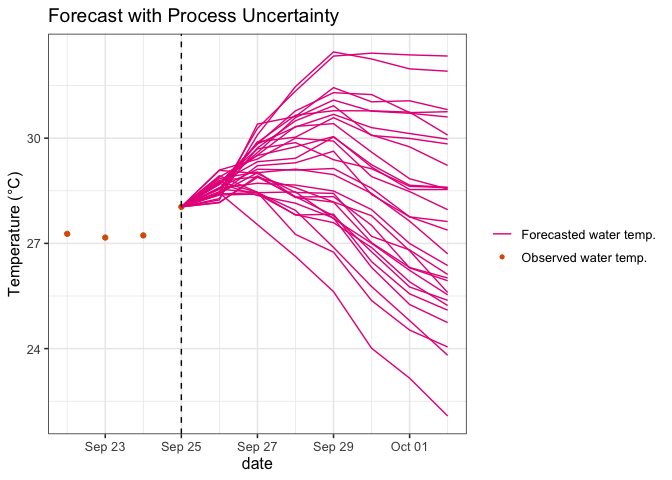<!-- -->

## 8. Generate a forecast with initial conditions uncertainty

**Initial conditions** uncertainty refers to uncertainty arising because
the initial conditions are not precisely known or because the
calculations cannot be performed with the precise initial conditions.

Even though we have measurements of water temperature from our lake, we
know that water temperature varies throughout the day so this
measurement might not capture exactly the temperature in our lake at
this time. Additionally, there may be observation error in our
temperature measurements.

To account for initial condition uncertainty we can generate a
distribution around the initial condition and then run our model with
slightly different initial conditions.

Generate a distribution of initial conditions for your forecast using
the current water temperature (`curr_wt`) and a standard deviation of
0.1 degrees Celsius (`ic_sd`).

``` r
ic_sd <- 0.1 
ic_uc <- rnorm(n = n_members, mean = curr_wt, sd = ic_sd)
```

Plot the distribution around your initial condition. This should
resemble the initial condition distribution plot in the R Shiny app,
Activity B Objective 8 (“Atemp” model).

``` r
plot_ic_dist(curr_wt, ic_uc)
```

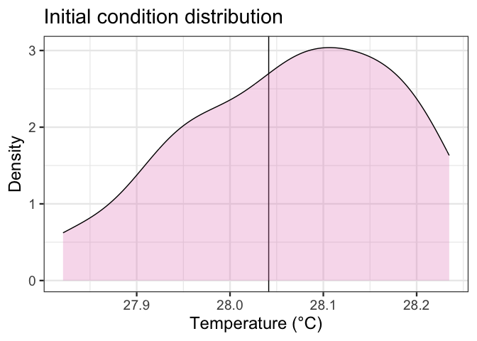<!-- -->

Generate a forecast that incorporates initial conditions uncertainty
only, holding all other sources of uncertainty (driver, parameter,
process) constant. Our ensemble has 30 members, with each member having
a slightly different initial conditions value.

Create dataframe with distribution of initial conditions.

``` r
ic_df <- tibble(forecast_date = rep(as.Date(forecast_start_date), times = n_members),
                ensemble_member = c(1:n_members),
                forecast_variable = "water_temperature",
                value = ic_uc,
                uc_type = "initial_conditions")
```

Setting up an empty dataframe that we will fill with our water
temperature predictions. **Note** the use of the `rows_update()`
function to populate the starting date of the forecast with values from
our initial conditions distribution.

``` r
forecast_ic_unc <- tibble(forecast_date = rep(forecasted_dates, times = n_members),
                            ensemble_member = rep(1:n_members, each = length(forecasted_dates)),
                            forecast_variable = "water_temperature",
                            value = as.double(NA),
                            uc_type = "initial_conditions") %>%
  rows_update(ic_df, by = c("forecast_date","ensemble_member","forecast_variable",
                            "uc_type")) 
```

Run forecast.

``` r
for(i in 2:length(forecasted_dates)) {
  
  #pull prediction dataframe for relevant date
    temp_pred <- forecast_ic_unc %>%
      filter(forecast_date == forecasted_dates[i])
    
  #pull driver data for relevant date; here we select only 1 ensemble member from the NOAA air temperature forecast
    temp_driv <- weather_forecast %>%
      filter(forecast_date == forecasted_dates[i] & ensemble_member == 1)
    
  #pull lagged water temp values
    temp_lag <- forecast_ic_unc %>%
      filter(forecast_date == forecasted_dates[i-1])
    
  #run model using initial conditions distribution instead of a fixed value
    temp_pred$value <- coeffs[1] + temp_driv$value * coeffs[2] + temp_lag$value * coeffs[3]
    
  #insert values back into forecast dataframe
    forecast_ic_unc <- forecast_ic_unc %>%
      rows_update(temp_pred, by = c("forecast_date","ensemble_member","forecast_variable","uc_type"))
}
```

Build plot - this should resemble the water temperature forecast plot in
the R Shiny app, Activity B Objective 8 (“Both” model)

``` r
plot_forecast(lake_obs, 
              forecast = forecast_ic_unc, 
              forecast_start_date,
              title = "Forecast with Initial Condition Uncertainty")
```

    ## Warning: Removed 7 rows containing missing values (`geom_point()`).

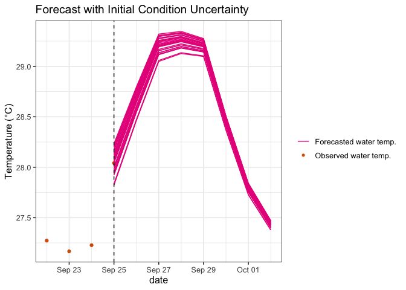<!-- -->

**Q.15 (Shiny)** What factors can lead to an increase in initial
conditions uncertainty?

**Answer Q.15**

**Q.16 (Shiny)** What potential steps could be taken to reduce initial
conditions uncertainty?

**Answer Q.16**

## 9. Generate a forecast incorporating all sources of uncertainty

To plot a forecast with all sources of uncertainty incorporated, we need
to generate a forecast that incorporates driver, parameter, process, and
initial conditions uncertainty.

Below, we will adjust the forecasting for-loop to incorporate all four
sources of uncertainty (driver, parameter, process, initial conditions)
into your forecasts. The forecast ensemble will have 30 members.

Setting up an empty dataframe that we will fill with our water
temperature predictions. **Note** the use of the `rows_update()`
function to populate the starting date of the forecast with values from
our initial conditions distribution.

``` r
forecast_total_unc <- tibble(forecast_date = rep(forecasted_dates, times = n_members),
                            ensemble_member = rep(1:n_members, each = length(forecasted_dates)),
                            forecast_variable = "water_temperature",
                            value = as.double(NA),
                            uc_type = "total") %>%
  rows_update(ic_df, by = c("forecast_date","ensemble_member","forecast_variable")) 
```

Run forecast. **Note** that we use all 30 NOAA air temperature forecast
ensemble members, use a distribution of parameter values rather than
fixed values, and have added process uncertainty to each iteration of
our forecast.

``` r
for(i in 2:length(forecasted_dates)) {
  
  #pull prediction dataframe for relevant date
    temp_pred <- forecast_total_unc %>%
      filter(forecast_date == forecasted_dates[i])
    
  #pull driver ensemble for relevant date; here we are using all 30 NOAA ensemble members
    temp_driv <- weather_forecast %>%
      filter(forecast_date == forecasted_dates[i])
    
     #pull lagged water temp values
    temp_lag <- forecast_total_unc %>%
      filter(forecast_date == forecasted_dates[i-1])
    
  #run model using initial conditions and parameter distributions instead of fixed values, and adding process uncertainty
    temp_pred$value <- param_df$beta1 + temp_driv$value * param_df$beta2 + temp_lag$value * param_df$beta3 + rnorm(n = 30, mean = 0, sd = sigma) 
    
  #insert values back into forecast dataframe
    forecast_total_unc <- forecast_total_unc %>%
      rows_update(temp_pred, by = c("forecast_date","ensemble_member","forecast_variable","uc_type"))
}
```

Build plot - this should resemble the water temperature forecast plot in
the R Shiny app, Activity C Objective 10 (“Both” model)

``` r
plot_forecast(lake_obs, 
              forecast = forecast_total_unc, 
              forecast_start_date,
              title = "Forecast with Total Uncertainty")
```

    ## Warning: Removed 7 rows containing missing values (`geom_point()`).

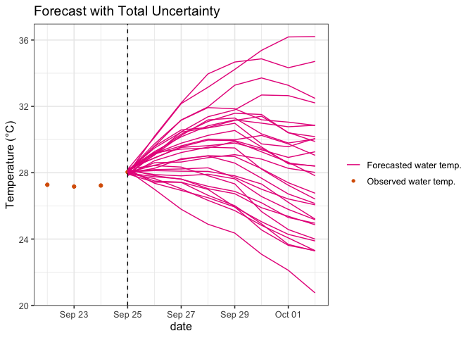<!-- -->

## 10. Partition uncertainty

Now, we will partition the relative contributions of each source of
uncertainty to total forecast uncertainty.

Combine the forecasts with a single source of uncertainty into one
dataframe.

``` r
all_forecast_df <- bind_rows(forecast_driver_unc, forecast_parameter_unc) %>%
  bind_rows(., forecast_process_unc) %>%
  bind_rows(., forecast_ic_unc)
```

Group the dataframe by date and the type of uncertainty included in the
forecast, then calculate the standard deviation across all 30 ensemble
members for each date and uncertainty type.

``` r
sd_df <- all_forecast_df %>%
  group_by(forecast_date, uc_type) %>%
  summarize(sd = sd(value, na.rm = TRUE)) %>%
  ungroup()
```

    ## `summarise()` has grouped output by 'forecast_date'. You can override using the
    ## `.groups` argument.

Plot the contribution of each source of uncertainty to total forecast
uncertainty. This should resemble the uncertainty quantification plot in
the R Shiny app, Activity C, Objective 10 (“Atemp” model).

``` r
plot_partitioned_uc(sd_df)
```

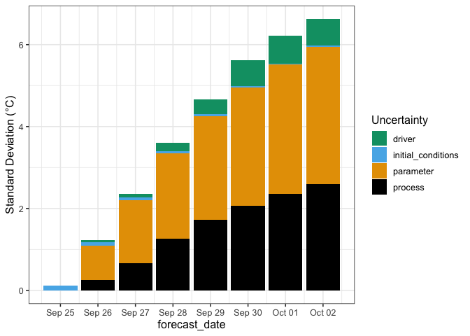<!-- -->

**Q.17 (Shiny)** Which source of uncertainty contributes the most to
total forecast uncertainty?

**Answer Q.17**

**Q.18 (Shiny)** You have been given \$5,000 to improve your water
temperature forecasts. What would you spend it on to reduce your
forecast uncertainty?

**Answer Q.18**

**Q.19 (Shiny)** Do you think that different lake sites would have the
same or different quantities of uncertainty? Why?

**Answer Q.19**

**Q.20 (Rmd)** Do you think that different water temperature forecast
models would have the same or different quantities of uncertainty? Why?

**Answer Q.20**

**Q.21 (Rmd)** How long did it take you to complete this module from
start to finish?

**Answer Q.21**

Congratulations! You have quantified all the uncertainty. Now, have a
nap. :-)

## Knitting and committing

Remember to Knit your document as a `github_document` and comment+push
to GitHub your code, knitted document, and any files in the `figure-gfm`
subdirectory that was created when you knitted the document.
